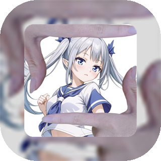
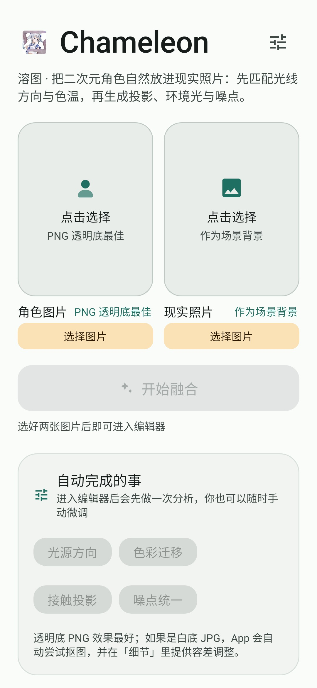
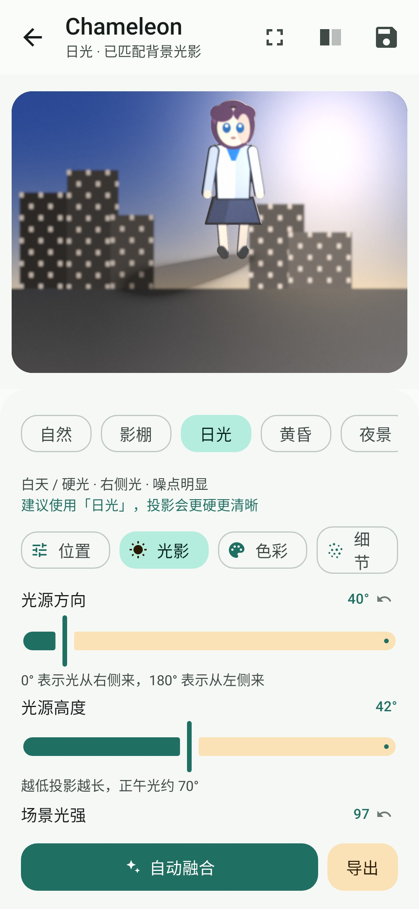
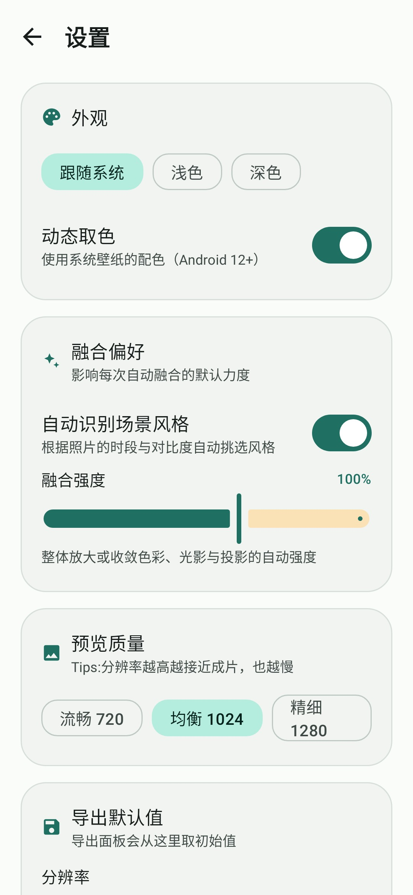
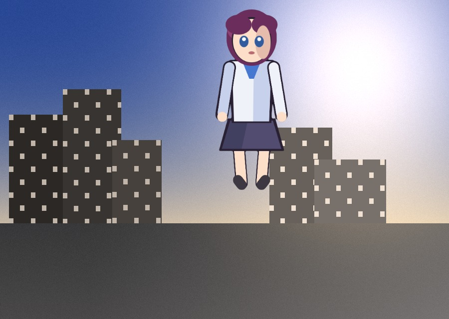
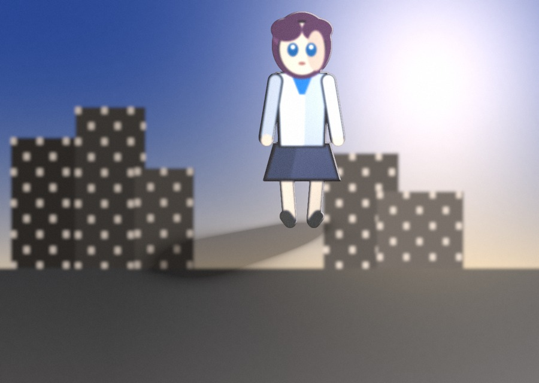
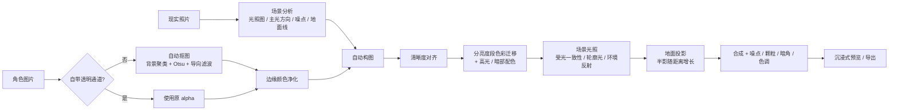

<div align="center">



# Chameleon · 溶图

**把二次元角色自然地「溶」进现实照片**

不是叠一张图，而是让角色接受照片的光线方向、色温、噪点与投影，看起来真的站在那个场景里。


[](https://github.com/Ulicedless/chameleon-demo/releases/latest)

[](https://github.com/Ulicedless/chameleon-demo/actions/workflows/android.yml)

[功能](#功能) · [效果](#效果) · [工作原理](#工作原理) · [工程结构](#工程结构) · [构建与运行](#构建与运行) · [测试与指标](#测试与指标) · [常见问题](#常见问题)

</div>

---

## 简介

Chameleon is an Android app that blends 2D anime characters into real photographs. It matches the
scene's key light direction, colour statistics, sensor noise and cast shadow, so the character looks
photographed in place instead of pasted on. Everything runs on device — no upload, no account, no
network permission.

## 功能

| 模块 | 能力 |
| --- | --- |
| **自动融合** | 分析照片后一次性给出光源方向、色彩迁移、投影、噪点匹配等参数，零配置也能出片 |
| **手动微调** | 位置 / 光影 / 色彩 / 细节 四个页签、30+ 个参数，全部实时预览 |
| **风格预设** | 自然、影棚、日光、黄昏、夜景、逆光、插画、胶片 8 种基调 |
| **抠图** | 透明底 PNG 直接使用 alpha；白底图自动抠图（Otsu 阈值 + 连通域保护 + 两次导向滤波），实测 IoU 0.96 |
| **边缘净化** | 用画稿内部颜色替换边缘残留的背景色，消除白边与彩边 |
| **沉浸式预览** | 全屏查看合成结果，双指缩放、拖动平移、双击复位、单击隐藏界面，可随时切换「看原图」 |
| **导出与分享** | 1280 / 1920 / 2560 px，JPG 或 PNG，保存到相册或直接分享；内存不足自动降级而不是失败 |
| **最近作品** | 原图、参数、抠图设置全部保存，可重新打开继续编辑 |
| **设置页** | 主题（跟随系统 / 浅色 / 深色）、动态取色、默认风格、融合强度、预览质量、导出默认值、抠图默认值、缓存清理 |

## 效果

<div align="center">

| 首页 | 编辑器 | 设置 |
| :---: | :---: | :---: |
|  |  |  |

</div>

算法层的直接贴图与融合结果对比（合成测试素材，可直接复现）：

| 直接贴图（未融合） | Chameleon 融合后 |
| :---: | :---: |
|  |  |

差异集中在四件事上：角色的高光与暗部被染上场景光源的颜色、脚下落在地面线上的投影、迎光侧的轮廓光、
以及背景亮暗变化作用到角色身上的光照梯度。

## 工作原理



### 算法要点

1. **抠图**：边框像素 k-means 聚类出背景色 → CIELAB 距离直方图上取 Otsu 阈值 → 连通域保护（保留画稿内部与背景同色的区域，例如白衬衫）→ 两次导向滤波（宽 + 紧）贴合画稿轮廓。
2. **边缘净化**：把半透明边缘里残留的背景色（白边 / 彩边）替换为从画稿内部向外松弛扩散得到的颜色，越透明替换越多。
3. **分亮度段色彩迁移**：在 CIELAB 空间把角色的明度 / 色度统计迁移到「角色所在区域」的背景统计，阴影、中间调、高光分别匹配——照片的暗部与高光本来就不是同一种颜色。
4. **高光与暗部配色**：角色自身的高光被染上场景主光的颜色、暗部被染上环境光的颜色，消除「角色来自另一个光源」的感觉。
5. **场景光照**：用背景低频亮度图作为入射光图（霓虹、窗户光会作用到角色上），沿光照方向做受光一致性，在迎光侧生成轮廓光、在脚部生成环境反射光。
6. **地面投影**：按「离地高度 h → 沿地面远离光源 h / tan(仰角)」投影，再用相机俯仰压缩系数压回地面，所以影子是**贴在地上**向一侧延伸，近处更实、远处更虚。
7. **统一细节**：对齐清晰度、按背景噪声 σ 补噪、颗粒、景深虚化、暗角、轻微色散，最后统一曝光 / 对比 / 饱和 / 色温色调。

## 工程结构

```text
app/src/main/java/com/chameleon/blend/
├─ core/                     纯 Kotlin 算法层（不依赖 android.graphics，可在 JVM 上单测）
│  ├─ img/RasterImage.kt     浮点平面图像缓冲（R/G/B/A 四个 FloatArray）
│  ├─ img/ImageOps.kt        可分离 / 各向异性模糊、形态学、导向滤波、重采样、噪声与细节统计
│  ├─ img/ParallelRows.kt    按行分块的并行执行器
│  ├─ color/ColorMath.kt     sRGB↔线性、RGB↔CIELAB、分亮度段色度统计、灰世界白平衡、色度压缩
│  └─ blend/
│     ├─ BlendParams.kt      全部参数 + 8 种风格预设
│     ├─ Placement.kt        构图求解（大小 / 地面线 / 三分法落点）
│     ├─ SceneAnalysis.kt    背景分析（光照图、光源方向、主光与环境色及其色度、噪点、细节、地面线、时段）
│     ├─ Matting.kt          抠图（背景聚类 + Otsu 阈值 + 连通域 + 两次导向滤波）
│     ├─ BlendPipeline.kt    融合管线（边缘净化 → 清晰度 → 色彩 → 光影 → 地面投影 → 合成 → 颗粒与色调）
│     └─ BlendEngine.kt      自动调参、场景文案、融合强度缩放、对比用「直接贴图」参数
├─ data/
│  ├─ BitmapIo.kt            sRGB 解码（ImageDecoder，自动 EXIF）、Bitmap↔RasterImage、相册保存与兜底、分享
│  ├─ SourceCache.kt         选图后立即保存的私有原图副本（导出不再依赖系统 URI 权限）
│  ├─ ProjectStore.kt        最近作品（原图 + 结果 + 参数 JSON）
│  ├─ BlendParamsJson.kt     参数与抠图设置的全字段序列化
│  ├─ AppSettings.kt         用户偏好数据类
│  └─ SettingsStore.kt       SharedPreferences 持久化 + StateFlow
├─ ui/
│  ├─ theme/                 Material 3 主题（玉青主色 + 动态取色）
│  ├─ components/Controls.kt 滑块行、卡片、筛选芯片等基础组件
│  ├─ home/HomeScreen.kt     首页
│  ├─ settings/SettingsScreen.kt 设置页
│  └─ editor/
│     ├─ EditorScreen.kt     编辑器 + 预览手势 + 沉浸式预览入口
│     ├─ ImmersivePreview.kt 全屏预览（缩放 / 平移 / 对比 / 隐藏系统栏）
│     ├─ EditorPanels.kt     控制面板与导出弹窗
│     ├─ EditorState.kt      UI 状态
│     └─ EditorViewModel.kt  解码、抠图、分析、两级预览渲染、导出、项目与设置
└─ MainActivity.kt           单 Activity + Compose，支持系统「分享图片到 Chameleon」
```

渲染分两级：拖动时用预览分辨率的一半快速预览，松手 260 ms 后跑精细预览；导出时按所选分辨率重新解码、
重新分析、重新渲染。

## 构建与运行

环境要求：JDK 21、Android SDK Platform 36.1（Build-Tools 36.1.0）、Android Studio 2026.1 或更新版本。
项目使用 AGP 9.2.1、Kotlin 2.2.10、Compose BOM 2026.02.01、Gradle 9.6.1，minSdk 29。

```bash
git clone https://github.com/Ulicedless/chameleon-demo.git
cd chameleon-demo

# Linux / macOS
./gradlew :app:assembleDebug

# Windows
gradlew.bat :app:assembleDebug
```

产物：`app/build/outputs/apk/debug/app-debug.apk`。也可以直接用 Android Studio 打开项目，Gradle Sync 后运行
`app` 模块。

不想自己编译的话，直接下载打包好的 APK：

- **最新版 v1.1.1** → [Chameleon.v1.1.1.apk](https://github.com/Ulicedless/chameleon-demo/releases/download/v1.1.1/Chameleon.v1.1.1.apk)（21.45 MB，Android 10+）
- 全部版本：[Releases](https://github.com/Ulicedless/chameleon-demo/releases)

安装包与 v1.0.0 / v1.1.0 使用同一签名密钥，可直接覆盖升级。下载后可用以下 SHA-256 校验完整性（v1.1.1）：

```
628545516047ffcff67f100c197e21a4f174464a43b645b9cac292a556611a4d
```

```bash
./gradlew :app:testDebugUnitTest   # 28 个单元 / 渲染测试
./gradlew :app:lintDebug           # 静态检查
```

> 项目不需要任何权限：图片通过系统照片选择器读取，保存走 MediaStore（Android 10+ 无需存储权限）。

## 测试与指标

算法层刻意不依赖 `android.graphics`，因此可以在普通 JVM 上跑完整数值指标；界面与平台层用 Robolectric
真实渲染。共 **28 个测试**（另有 1 个按需运行的截图生成测试，默认跳过）：

| 测试类 | 数量 | 覆盖内容 |
| --- | :---: | --- |
| `BlendPipelineTest` | 7 | 场景分析、自动调参、融合正确性、色彩迁移、渲染确定性、空前景、抠图基础 |
| `BlendQualityTest` | 7 | 投影、轮廓光、光照梯度、背景保护、颗粒、预览性能、2560 px 导出内存 |
| `BlendUpgradeTest` | 5 | 边缘净化、分亮度段配色、高光配色、抠图 IoU、投影半影 |
| `HomeScreenRenderTest` | 4 | 首页 / 编辑器 / 设置页真实渲染与回调 |
| `AndroidBridgeTest` | 5 | PNG 往返与 alpha、项目读写、参数 JSON、私有原图副本、保存兜底 |

关键实测数字（合成测试素材，`BlendQualityTest` / `BlendUpgradeTest` 会打印）：

| 指标 | 结果 |
| --- | --- |
| 地面投影强度 | 光向带内 p15 亮度 0.324 → **0.188** |
| 轮廓光 | 迎光侧边缘 **+0.29**，背光侧 +0.07 |
| 光照梯度 | 背景亮区内角色 **+0.051**，暗区 +0.001 |
| 背景保护 | 脚印影响区外 **0 像素漂移**（合成严格局部化） |
| 高光配色 | 与主光色度距离 6.63 → **2.96** |
| 分亮度段色度误差 | 8.39 → **6.33** |
| 边缘净化误差 | 0.119 → **0.084** |
| 抠图 IoU | **0.963** |
| 投影半影 | 近处宽度 74 px / 远处 76 px，核心深度 0.43 → 0.24 |
| 性能 | 1280×900 快速预览 ~0.26 s、精细 ~0.30 s；2560×1920 导出 2.3 s，136 MB 堆内完成 |

测试会把合成过程的可视化结果写到 `app/build/engine-preview/`，包括 `01-naive-paste.png` 与
`02-blended.png`。README 里的截图与对比图由测试生成：

```bash
CHAMELEON_SCREENSHOTS=1 ./gradlew :app:testDebugUnitTest --tests "*ScreenshotGeneratorTest"
```

## 图标

图标资源由 `tools/generate_icon.ps1` 生成（自适应前景 / 背景 + 单色层 + README 展示图）：

```powershell
powershell -ExecutionPolicy Bypass -File tools/generate_icon.ps1 -Source icon.jpg
# 没有原图时，也可以直接用仓库里已有的自适应图层重建：
powershell -ExecutionPolicy Bypass -File tools/generate_icon.ps1 -FromLayers
# 仅当 minSdk < 26 时，才需要额外生成 5 档密度的传统位图：
powershell -ExecutionPolicy Bypass -File tools/generate_icon.ps1 -LegacyBitmaps
```

本项目 minSdk 为 29，自适应图标在所有目标设备上都会被使用，因此仓库不包含那些传统密度位图。

脚本会自校验「背景层完全不透明、前景留白透明、中央有画面」，不合格直接报错，避免生成在浅色启动器上
看起来「缺了一块」的错误资源。

## 常见问题

<details>
<summary><b>为什么应用设置里找不到存储权限？保存到相册失败怎么办？</b></summary>

Android 10 及以上保存图片到相册不需要任何存储权限，系统媒体库 MediaStore 会代为写入，所以设置里本来
就没有这一项。如果相册写入被系统拒绝（受限账户、媒体库异常、空间不足），应用会自动改写到应用专属目录
并提示文件位置，而不是直接失败。
</details>

<details>
<summary><b>第一次导出成功，之后就提示导出失败？</b></summary>

这是早期版本的缺陷，已修复。原因有两个：一是选图返回的 `content://` URI 读权限只在本次会话内有效，
会话结束后重新解码会失败；二是 2560 px 导出的内存峰值接近上限，第二次更容易触发 `OutOfMemoryError`。
现在的做法是：选图后立刻把原图复制到应用私有目录，导出只读自己的副本；内存不足时自动按 1792 → 1254
逐级降级，最后退到用内存里已有的预览图导出，并明确提示实际分辨率。
</details>

<details>
<summary><b>效果还不够理想，从哪里调？</b></summary>

按这个顺序最快：先确认脚部是否落在地面线上（真实感第一要素）→ 调「投影强度 / 接触阴影 / 投影长度」→
再调「色彩融合」与「高光 / 阴影配色」→ 最后处理「噪点匹配 / 颗粒 / 清晰度匹配」。夜景与霓虹场景把
「轮廓光」和「噪点匹配」拉高；想保留插画感就用「插画」风格并把色彩融合降到 0.3 左右。
</details>

<details>
<summary><b>手机比较慢怎么办？</b></summary>

在设置里把「预览质量」改为「流畅」，拖动会更跟手；导出仍可选 2560。算法层已经用按行并行与查表替代
逐像素 `pow()`，1280 px 预览在桌面 JVM 上约 0.3 s。
</details>

<details>
<summary><b>装上新版后桌面还是旧图标？</b></summary>

启动器会缓存图标。卸载重装一次，或重启启动器（部分机型需要重启桌面进程）即可刷新。
</details>

<details>
<summary><b>Windows 上 Gradle 报 <code>Unable to establish loopback connection</code>？</b></summary>

这是 JDK 17+ 在部分 Windows 环境（`%TEMP%` 被解析成 8.3 短路径，或存在虚拟网卡）下创建 AF_UNIX
Selector 唤醒管道失败导致的，与项目无关。把临时目录指到一个纯 ASCII 短路径即可：

```powershell
New-Item -ItemType Directory -Force C:\TempCodex
$env:JAVA_TOOL_OPTIONS = "-Djdk.net.unixdomain.tmpdir=C:\TempCodex"
gradlew.bat :app:assembleDebug
```
</details>

## 路线图

- [ ] 用 AGSL `RuntimeShader`（API 33+）把几何与光照搬到 GPU，导出提速一个量级
- [ ] 手绘蒙版笔刷，处理背景复杂、难以自动抠图的素材
- [ ] 参考图驱动的调色迁移（把某张照片的色调直接映射到成片）
- [ ] 批量处理与预设导入导出
- [ ] 英文界面

## 贡献

欢迎提 Issue 与 PR。提交前请确保：

```bash
./gradlew :app:testDebugUnitTest :app:lintDebug
```

新增算法改动时，请在 `BlendQualityTest` / `BlendUpgradeTest` 里补一条可量化的断言，而不是只改常量。

## 许可证

本项目基于 [MIT License](LICENSE) 开源，你可以自由使用、修改与分发，只需保留版权声明。

Copyright (c) 2026 Ulicedless

---

<div align="center">
<sub>Chameleon · 全部处理都在本机完成，不上传任何图片</sub>
</div>
